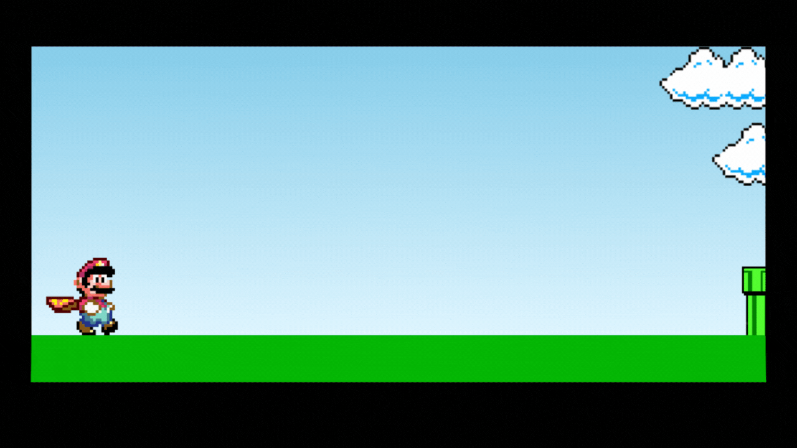

# Project Super Mario Bros in JavaScript 

In this project, a simple game inspired by Super Mario Bros was developed, in which it is possible to jump obstacles by clicking on any key and you lose when you hit an obstacle.



---

## About the project
This project was developed with the help of [this](https://www.youtube.com/watch?v=r9buAwVBDhA&t=855) tutorial on YouTube posted by the [Manual do Dev](https://www.youtube.com/@ManualdoDev) channel.

---

## Technologies used
    * HTML
    * CSS
    * JavaScript

---

## How to run the project
To install and run the project you must have [Visual Studio Code](https://code.visualstudio.com/) installed and configured with the extension [Live Server](https://marketplace.visualstudio.com/items?itemName=ritwickdey.LiveServer).

Using the terminal, clone the project:
```
$ git clone git@github.com:AlineCarolina/Mario-Javascript.git
```
Enter the repository folder you just cloned:
```
$ cd Mario-Javascript
```

Open a project and click Go Live on the status bar to turn the server on/off.


The page will automatically load in your browser.


---
